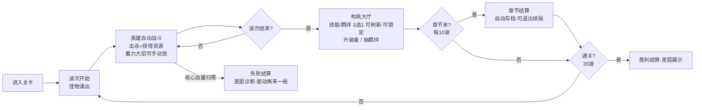

# 《Project Roguelike-TD》游戏设计文档（GDD v0.1）

> 状态：草案，待 review。所有数值为**起始平衡点**，用于跑通公式与曲线，正式数值以 playtest 为准。
> 本文档聚焦：核心循环 → 数值骨架（公式/曲线/表）→ 三大系统（技能/装备/羁绊）→ 联动引擎 → 经济与节奏。

---

## 0. 一句话定位

**横屏移动端、英雄为核心、带强 Rogue 构筑的波次防守游戏**。参考 KK 平台英雄防守图 + 金铲铲（羁绊/池子）+ 小丑牌（高风险高回报的词条赌博 + 商店刷新）。玩家防守 30 波进攻，通过"技能/羁绊 3 选 1（可刷新）+ 手动大招 / 装备养成 / 羁绊抽取与吞噬"三条互相联动的成长线滚雪球。**核心心流目标见 `ENGAGEMENT_DESIGN.md`——"上头"靠 build 因果透明 + near-miss，不靠难度。**

> **实现现状（M0–M2 ✅）**：英雄既是防守目标又是输出（hero-as-core，决策 16）；弹道锁定追踪（决策 17）；羁绊成本递增 + 池子多样性（决策 18/19）。下一步计划从固定路径演进为**房间生存**（英雄可移动、怪随机刷追击，土豆兄弟式）——见技术文档 §8.2。

---

## 1. 设计支柱（Pillars）

| 支柱 | 含义 | 对设计的约束 |
|---|---|---|
| **构筑爽感 Build Fantasy** | 每局都能拼出"离谱的数值组合" | 倍率必须能指数级叠加；多系统联动 |
| **每局不同 Replayability** | 局局体验不同 | Rogue 抽取池 + 词条随机 + 羁绊组合 |
| **风险换收益 Risk/Reward** | 像小丑牌，敢赌才变强 | 诅咒=代价换收益（势均力敌、难取舍）；羁绊池要取舍 |
| **秒懂、深度可挖** | 上手 1 分钟，构筑空间巨大 | 机制标签化（暴击/真伤/多重射…）；伤害乘区逐段可见 |
| **移动端友好** | 横屏、可碎片化、自动战斗 | 单章 8–10min / 完整 run ≤25min；可中断保留续局 |
| **Combo 可见** | 玩家能"看见"自己的 build 在咬合 | 命中伤害逐段弹出；结算诊断"差在哪" |

---

## 2. 核心循环



- **波次结构**：30 波 = 主线，分 3 章节（每 10 波一章）。每 5 波一个小精英，第 10/20/30 波 Boss。
- **章节分段（决策）**：每章 8–10min，章末**自动存档**，可中途退出、下次续局（适配碎片时间）。完整 run ≤ 25min。
- **构筑大厅**：波次结束后进入，可花资源做任意顺序的操作（技能/羁绊抽取**可刷新、可锁定**——见 §4.4）。确认后开下一波。
- **战斗中可微操（决策）**：英雄自动战斗 + **手动大招**（蓄力型，见 §11），给关键时刻掌控感。
- **失败/成功结算**：显示**差距诊断**（差多少伤害、建议补什么乘区）——驱动"再来一局"，详见 `ENGAGEMENT_DESIGN.md` M5。

---

## 3. 数值骨架（重点）

> 设计哲学：**敌人指数成长 → 玩家也必须指数成长 → 倍率要能"乘法叠加"**。
> 三层职责：
> - **羁绊 = 基础数值**（加法，撑起 ATK 等底子）
> - **技能/词条 = 伤害倍率**（混合加法/乘法，决定伤害表达）
> - **联动 = 最终乘区**（乘法、稀有、滚雪球的关键）

### 3.1 伤害主公式（Master Damage Pipeline）

每次命中：

```
hit_damage = ATK × atk_ratio × dmg_type_mult × skill_mult × final_mult × elemental_mult × crit_factor × defense_mult
DPS        = Σ(每次命中伤害) × attack_speed × projectile_count  （多段/多重射展开）
```

**英雄基础属性（SSOT，脚本据此锁定回归基线）**：
- 基础 ATK = 50
- 基础暴击率 = 5%
- **基础暴击伤害 = 150%**（即暴击造成 1.5 倍伤害；§8 走查的 210% = 150% + 60% 来自"聂家霸刀"羁绊）
- 基础攻速 = 1.0 次/秒

| 项 | 公式 | 说明 / 谁控制 |
|---|---|---|
| `ATK` | 基础 + Σ羁绊加成 | **羁绊层**控制；英雄基础 ATK = 50 |
| `atk_ratio` | 技能/武器系数（如 1.0、0.6×3 连击） | 技能定义 |
| `dmg_type_mult` | `1 + 物伤%` 或 `1 + 法伤%`（看技能标签） | 技能词条（**加法**叠加） |
| `skill_mult` | `1 + Σ技能内倍率词条`（+30% 物伤等） | 技能词条（**加法**叠加） |
| `final_mult` | `Π(1 + 最终伤害%)`（每条**乘法**） | **联动/吞噬**奖励，稀有且强 |
| `elemental_mult` | `1 + Σ属性伤害%`（火/冰/雷，独立乘区，**加法**叠加） | 技能词条（独立于物伤/法伤） |
| `crit_factor` | 暴击 ? 暴伤 : 1；期望 = `1 + 暴击率×(暴伤−1)`，基础暴伤=150% | 词条 |
| `defense_mult` | `1 − mitigation×(1−穿甲)`；**真伤**直接取 1 | 敌人护甲/抗性 |

**护甲减伤**：`mitigation = armor / (armor + K)`，K = 100（线性软上限，避免堆甲无敌）。
**真伤**：跳过 defense_mult，直接结算（用于"打不动的高甲怪"设计）。
**属性伤害**（火/冰/雷）：走 `elemental_mult` 独立乘区 + 附带状态（燃烧 DOT / 冰冻减速 / 雷链弹射）。

### 3.2 叠加规则（防止数值爆炸的关键）

| 类型 | 规则 | 例子 |
|---|---|---|
| 同源加法（同标签 %） | 加法叠加，收益递减感弱 | 物伤 30% + 30% = 60% |
| 跨源乘法（最终伤害） | 乘法叠加，每条都很强 | 最终 15% × 最终 20% = 1.15×1.20 |
| 暴击 | 率/伤分开，率封顶 100% | — |
| 多重射 | 每多 1 根弹 = 整段伤害再复制 | x2 弹 ≈ DPS×2（吃减益递减：散射） |

> **设计意图**：把"超强组合"的成本压在 **final_mult（联动）** 上，使其稀有、需要凑齐羁绊+技能才能触发 → 这就是"1+2+3 联动"的数值落点。

### 3.3 敌人曲线（30 波）

`enemy_hp = 100 × 1.18^(wave−1)`，敌人数量 `= round(8 + 1.5×wave)`。

> 注：下表数值为公式计算结果（四舍五入），用于速查；以**公式**为 SSOT，脚本据此锁定。

| 波次 | 平均血量 | 怪物数 | 总血量 | 时长(s) | 所需 DPS |
|---:|---:|---:|---:|---:|---:|
| 1  | 100   | 10 | 1,000   | 26 | 38 |
| 5  | 194   | 16 | 3,102   | 30 | 103 |
| 10 | 444   | 23 | 10,212  | 35 | 292 |
| 15 | 1,015 | 30 | 30,442  | 40 | 761 |
| 20 | 2,321 | 38 | 88,198  | 45 | 1,960 |
| 25 | 5,311 | 46 | 244,306 | 50 | 4,886 |
| 30 | 12,150| 53 | 643,953 | 55 | 11,708 |

> **Boss 波血量定义（消除歧义）**：Boss 波的"总血量"**已包含 Boss 本体**——即 总血量 = Σ小怪血量 + Boss 血量，Boss 占其中的 `boss_total_hp_share`（40%）。表中的"所需 DPS"按此总血量 / 时长计算。**"单独结算"仅指 Boss 有独立血条 UI 显示**，并非额外再算一份 DPS 需求。曲线是**指数**，意味着玩家 DPS 也必须指数增长 → 这就是为什么 final_mult 必须能乘法叠加。
>
> ✅ **B-3 校准完成（曲线 1.05，1000 局 18% 通关，near-miss 100%，全达标）**：
> - **原问题**：1.18 曲线下 0% 通关（完美 build 也只到 12 波）——玩家加法叠加的 DPS 跟不上指数曲线。
> - **校准**：曲线 1.18→**1.05** + 收入 ×3 + 羁绊 effect ×3.5。
> - **near-miss 模型**：清完波英雄持续受压（6-12%/波，但不致死，最低 25%）；清不完波强制打到残血（5-15%，主要死因）。波间回血 5%/波制造"贴线"节奏。（英雄即核心，决策 16；怪走到英雄 = 扣英雄血）
> - **结果**：通关率 18%（目标 10-40% ✅）、中位死波 15（目标 15-25 ✅）、**死时血量 100% 落在 5-20% 惜败区**（near-miss 目标 ✅，驱动"再来一局"）。
> - 第 15 波所需 DPS 从 761（1.18）→ **148**（1.05），中期 build(345) 现在能过。
> - 详见站点 /run.html（玩家 vs 所需 DPS 曲线、死亡波次分布）。

### 3.4 资源经济（由"装备层"驱动）

局内货币 = **金币**（仅当局有效；局外 meta 货币可后续设计）。

**收入（基础值，装备词条会放大）**

| 来源 | 数值 |
|---|---|
| 基础被动 | 5 金/秒 |
| 击杀 | 2 金/只 |
| 波次清场 | 60 金/波 |
| Boss/精英 | 额外 150 / 40 金 |

**支出**

| 行为 | 成本 |
|---|---|
| 抽羁绊（3 选 1） | 30 金 + 10×已抽次数，封顶 60（B-2 校准：递增收紧后期）✅ M2 已实现 |
| 装备升级 | 15 + 4×当前等级 |
| 吞噬羁绊组合 | 80 金（GDD §6.1，金币 sink；每套仅一次） |
| 技能重投 | 20 金起，每次 +5（每波上限 3 次，见 §4.4） |
| 羁绊重投 | 15 金起，每次 +5（每波上限 3 次，见 §4.4） |
| 技能跳过换金 | +20 金（放弃 3 选 1） |

> 经济曲线目标：每波结束后有足够的成长反馈节奏。
>
> ✅ **B-2 校准完成（境界树 + 收入二次减半，1000 局模拟达标）**：B6 saturation 已根治。
>
> **三步修复**：
> 1. **羁绊境界树（§6.1）**：每体系 = 修炼路径（凡体→圣体→王体→皇体→帝体），凑齐当前境界羁绊→吞噬→升境→再抽。**解决"有事做"**（后期 4 次/波，丰富的修炼追求）。
> 2. **抽羁绊成本上限**：30+10×n 封顶 60（防后期不敢抽）。
> 3. **收入二次减半**（base_passive 1, per_kill 0.5, per_wave_clear 15, boss 40）：**解决"钱花不完"**。
>
> **最终结果（数据驱动，非拍脑袋）**：
> | 指标 | 原 | 现 | 目标 |
> |---|---|---|---|
> | 终局囤积 | 9634 | **255** | <500 ✅ |
> | 后期操作数 | 1（崩盘） | **4** | 3-5 ✅ |
> | 重投率 | 3% | 77% | 30-50%（偏高，可收紧 cap） |
>
> **结论**：囤积问题根因是"收入虚高"，限制收入获取速度（二次减半）是最干净的解法。境界树解决了心流（永不无聊）。两者配合达标。详见站点 /economy.html。

---

## 4. 系统 1：技能（控制"怎么打伤害"）

### 4.1 结构

- 每个技能 = **基础机制** + **词条槽**。技能最高 5 级（重复抽到 = 升级）。
- 技能带**标签**：物理 / 法术、单体 / AOE / 弹射、火/冰/雷…
- **品质**：普通 / 稀有 / 史诗 / 传说，影响基础数值与抽取权重。

### 4.2 词条池（机制标签 = 你列举的那些）

| 词条 | 效果 | 稀有 | 叠加 |
|---|---|---|---|
| 多重射 | +1 投射物（散射 -15% 伤害） | 稀有 | 加法（弹数） |
| 暴击率 | +15% | 普通 | 加法，封顶 100% |
| 暴击伤害 | +50% | 普通 | 加法 |
| 物伤加成 | +30% | 普通 | 加法（同源） |
| 法伤加成 | +30% | 普通 | 加法 |
| 最终伤害 | +15%（乘区） | **传说** | **乘法** |
| 攻速 | +20% | 普通 | 加法 |
| 眩晕 | 命中 20% 概率眩晕 1s | 稀有 | 概率加法 |
| 无视护甲 | 穿甲 +30% | 稀有 | 加法 |
| 抗性穿透 | +30% | 稀有 | 加法 |
| 反伤 | 反弹 25% 受击伤害 | 稀有 | — |
| 属性伤害 | 附加火/冰/雷 +20% 并附加状态 | 稀有 | 独立乘区 |
| 真伤 | 10% 伤害转为真伤 | 史诗 | 加法 |
| 减伤 | 受到的伤害 -15%（生存向） | 稀有 | 加法，封顶 75% |

### 4.3 抽取规则（3 选 1）

每次"技能升级机会"（每清一波给 1 次，Boss 波给 2 次），roll 3 个选项：
- 每个选项：50% 是"新技能"（你没拥有的），50% 是"已有技能的词条"。
- 按品质加权：普通 60 / 稀有 30 / 史诗 8 / 传说 2。
- **若 3 个都不想要**：允许"跳过 → 换 20 金"（给玩家止损，避免卡手）。

> 数值意图：传说级"最终伤害"词条极稀有（权重 2），是后期滚雪球的核心，呼应"联动乘区"设计。

### 4.4 刷新与锁定（商店机制，决策 1）

> 这是补上小丑牌"刷新商店找关键牌"动作的关键——让"攒钱 = 更多重投 = 更易凑齐 combo"，把经济层和构筑层咬合成闭环。详见 `ENGAGEMENT_DESIGN.md` M2。

在**构筑大厅**里，技能与羁绊的 3 选 1 都可花金币刷新：

| 操作 | 基础成本 | 每次递增 | 每波软上限 | 锁定 |
|---|---|---|---|---|
| 技能重投 | 10 金 | +3 金 | 5 次/波 | 花少量金币锁定 1 张不随刷新消失 |
| 羁绊重投 | 8 金 | +3 金 | 5 次/波 | 同上 |

- **递增成本**防止无限刷新破坏随机性；**软上限**强制玩家在"刷更好的"和"留着钱做别的"间取舍（小丑牌利息系统的等价物）。
- **锁定**给"差一张就成型"的玩家希望与策略空间。
- 装备**保底轨不刷新**（确定性是它的价值）。

> 经济验收（B-2）：输出"玩家平均重投次数 vs 通关率"曲线。几乎不刷=成本太高；无限刷=太便宜。

---

## 5. 系统 2：装备（控制"怎么变富/经济"）

### 5.1 双轨 Rogue 方案（融合你提的两种）

- **保底轨（资源升级）**：花金币升级装备，**每级固定加一条经济属性**（确定性，尊重玩家操作）。
- **赌博轨（里程碑抽词条）**：装备升到 +3/+6/+9 时，抽 1 条词条，**好坏都有**（小丑牌式风险）。
- **掉落轨（纯运气，可选 spice）**：精英/Boss 有概率掉"成品装备"，作为额外惊喜，不作为主路径。

### 5.2 装备词条池（经济向 + 诅咒＝代价换收益）

> 决策：诅咒**不是纯惩罚**，而是"代价换收益"——代价与收益势均力敌，让玩家**难以取舍**（详见 `ENGAGEMENT_DESIGN.md` §10）。每条诅咒至少在一种 build 下是"最优解"。

**经济词条（正）**

| 词条 | 效果 |
|---|---|
| 每秒金币 +3 | 被动收入 +3/s |
| 杀敌金币 +1 | 每只 +1 |
| 一次性金币 +80 | 即得 |
| 金币倍增 | 所有金币 ×1.15（乘区，强） |
| 双倍金币概率 | 15% 概率金币×2 |
| 羁绊抽取折扣 | 抽羁绊 -5 金 |
| 羁绊吞噬增益 | 吞噬羁绊时额外效果 +1 级（联动向） |

**诅咒词条（代价 ↔ 收益，纠结型）**

| 词条 | 代价 | 收益 | 适配 build |
|---|---|---|---|
| 血祭 | 受到伤害 +25% | 金币获取 +60% | 滚雪球经济流 |
| 焚天 | 每 5 秒掉 1% 核心血量 | 最终伤害 +20%（乘区） | 斩杀/爆发流 |
| 断舍离 | 羁绊池上限 -2 | 每个羁绊效果 +30% | 少而精构筑 |
| 厄运契约 | 抽取成本 +20% | 抽到传说概率 +50% | 赌狗流 |
| 时之刃 | 攻速 -15% | 每次命中伤害 +40% | 慢速重击流 |

> **平衡验收**（B-3 蒙特卡洛）：每条诅咒携带率 15%–35%；携带 vs 不携带通关率 ±10%；同一诅咒在不同 build 中效果差异大。平衡手段是调收益数值，而非取消代价。
> 装备**不直接给常规战斗数值**（战斗数值归羁绊/技能），诅咒的代价/收益是这条规则的**例外**——正是这个例外制造了"要不要接这个 deal"的张力。

### 5.3 装备升级曲线

| 等级 | 成本 | 固定收益 |
|---:|---:|---|
| +1 | 15 | +1 金/秒 |
| +2 | 19 | +0.5 杀敌金 |
| +3 | 23 | +1 金/秒 + **抽词条** |
| +6 | 35 | 抽词条 |
| +9 | 47 | 抽词条（保底为正） |

> +9 的里程碑词条**保底为正面**（防脸黑劝退），是"长线投资"的回报。

---

## 6. 系统 3：羁绊（控制"基础数值/底子"）

### 6.1 机制

- 花 30 金**抽取**，3 选 1，放入**羁绊池**（上限 10）。
- **可刷新（8 金起递增）/可锁定**——见 §4.4，与技能抽取同一套商店机制。
- 每个羁绊给一条**基础数值**（ATK%、血量%、攻速%、暴击…）。
- 羁绊按"**阵营/套系**"分组（主题化，见 6.3）。
- **满足套系条件 → 可吞噬**：消耗池中对应羁绊 → 获得强力**吞噬效果**，并进入"**已吞噬池**"。
- **已吞噬池**用于触发跨系统联动（见第 7 节）。
- **与诅咒的交互**：诅咒"断舍离"会把池子上限 -2（换"每个羁绊效果 +30%"")——精铺流的核心取舍。
- **池满时拿"断舍离"的规则**：若获取时池中羁绊数 > 新上限（10−2=8），**玩家手动选丢弃哪些**直到不超限（不自动丢弃，尊重玩家选择）。获取前会有警告提示。

### 6.2 池子取舍（Risk/Reward）

- 池子上限 10 → 玩家必须在"留着凑套系 / 吞噬腾位 / 换更强单卡"间取舍。
- 这就是金铲铲式的"卡位经营"，但在 Rogue 防守里。

### 6.3 示例套系（8 套，机制优先，主题占位可换皮）

> 共 8 个套系，覆盖**爆发/攻速/暴击/法术/生存/经济/召唤/控制**八大定位。机制优先设计，主题名为占位，后续可换皮成具体 IP 或原创世界观。
> ⚠️ IP 提醒：遮天/风云/黑神话 仅为主题参照，商业上线须授权或换皮。
> **换皮工程化（数据层）**：`bonds.yaml` 等数据用**中性 id**（`zhutian/fengyun/xingyun` 等），机制数值与 id 绑定、不与 IP 名绑定；**展示名**集中到 i18n 文案层。换皮时只改文案，机制与数值不动。

| 套系 | id | 定位 | 2件套 | 3件套(吞噬) |
|---|---|---|---|---|
| 遮天 | zhutian | 爆发/最终伤害 | +20%ATK | 天帝: 全伤+50%(final乘区) |
| 风云 | fengyun | 攻速/连击 | +15%攻速 | 风云合击: 每3击追击100% |
| 黑神话 | blackmyth | 生存/变身 | +15%血+10%减伤 | 大圣: 8s变身AOE+100%攻速 |
| 星陨 | xingyun | 暴击/赌狗 | +10%暴击率 | 星陨祝福: 暴伤+50% |
| 苍焰 | cangyan | 法术/元素 | +20%法伤 | 元素精通: 属性伤害+30% |
| 铁壁 | tiebi | 生存/反伤 | +10%减伤+15%血 | 不可破: +20%减伤+30%反伤 |
| 淘金 | taojin | 经济/滚雪球 | +15%金币 | 黄金时代: +30%金币+10%攻 |
| 兽魂 | shouhun | 召唤/持续 | +15%攻+10%攻速 | 群猎: +25%攻+3%吸血 |

**示例羁绊**（每套约 4 张，共 ~32 张 + 套系定义）：
| 羁绊 | 数值 |
|---|---|
| 荒古圣体 | +15% ATK |
| 天帝鼎 | +10% 最终伤害（乘区） |
| 圣人果位 | +10% 暴击率 |

- 2 件套：+20% ATK。
- 3 件套（**吞噬**）：消耗 3 张 → 获得"**天帝**"效果：全伤害 +50%（最终乘区），并触发与"天帝拳"技能的联动。

**套系 B：风云（攻速/连击向）**
| 羁绊 | 数值 |
|---|---|
| 风神腿 | +20% 攻速 |
| 排云掌 | +25% 技能倍率 |
| 聂家霸刀 | +60% 暴伤 |

- 3 件套（**吞噬**）："**风云合击**"：每第 3 次攻击额外触发一次 100% 伤害的追击。

**套系 C：黑神话（生存/变身向）**
| 羁绊 | 数值 |
|---|---|
| 天命人 | 全属性 +5% |
| 定身法 | 命中 10% 概率定身 0.5s |
| 法天象地 | +30% 血量、+15% 减伤 |

- 3 件套（**吞噬**）："**大圣**"：每 60s 触发 8s 变身，期间攻击变为 AOE 且 +100% 攻速。

**套系 D：精灵（原"宝可梦"，建议换皮）**
机制示例：元素克制双倍、进化（吞噬=进化形态）。商业版用原创"灵兽"设定。

---

## 7. 联动引擎（1+2+3 的核心）

> 这是把三大系统缝合成"构筑爽感"的关键。用**数据驱动的规则引擎**实现（详见技术文档）。

**触发条件语义（消除歧义）**：
- `bond_owned`：羁绊**当前在羁绊池中**（未被吞噬）。一旦被吞噬，移出羁绊池，不再算 owned。
- `bond_devoured_set`：该套系已被吞噬（套系羁绊已移入"已吞噬池"）。
- 即：圣体真伤（`bond_owned: ancient_saint_body`）只在**荒古圣体还在池里**时触发；若玩家把它吞噬了去凑遮天 3 件套，则该联动**停止**，改由"天帝之拳"（`bond_devoured_set`）这类联动接管。这制造了"留着单卡吃小联动 vs 吞噬换大联动"的取舍。

**规则结构（伪数据）**：

```yaml
- id: zhutian_emperor_fist
  name: 天帝之拳
  trigger:
    all:                                  # 全部满足才触发
      - bond_devoured_set: zhutian        # 已吞噬"遮天"套
      - skill_owned: emperor_fist         # 拥有"天帝拳"技能
  effect:
    final_damage_mult: +1.0               # 最终伤害 +100%（乘区）
    note: 天帝拳额外造成 100% 伤害
```

**联动清单（首版做 8 条；其中 3 个为 Tier-S 终极 combo）**

| 联动 | Tier | 触发 | 效果 |
|---|---|---|---|
| **天帝之拳** | **S** ★ | 吞噬遮天 + 天帝拳 | 天帝拳最终伤害 +100% |
| **大圣闹天** | **S** ★ | 吞噬黑神话 + 装备"金币倍增" | 变身期间金币 ×3 + AOE |
| **风雷合击** | **S** ★ | 吞噬风云 + 技能带"雷"标签 | 雷属性额外弹射 3 次 + 追击 |
| 圣体真伤 | A | 荒古圣体 + 真伤词条 | 真伤比例 +15% |
| 风云追击 | A | 吞噬风云 + 任意 | 每 3 次攻击追击 100% 伤害 |
| 鼎立圣威 | A | 天帝鼎 + 圣人果位 | 最终伤害 +15%（乘区） |
| 厄运契约 | B | 诅咒"厄运契约" + 抽到传说 | 该传说效果额外 +50% |
| ... | B | （更多待补充） | ... |

> **Tier-S 是长线追求钩子（决策 5：首版 3 个）**——在图鉴里显示为模糊剪影 + 诱人描述，激发追求欲。完整心流见 `ENGAGEMENT_DESIGN.md` M6。
>
> ✅ **B-3 联动引擎已实装并验证（数据驱动）**：
> - **transform（变身）**：周期性触发（duration/cooldown），按波次覆盖率加权攻速倍率 + AOE 清场加成。
> - **chain（连锁弹射）**：每次命中额外弹射 N 次（递减 decay 0.7），DPS 乘数 = 1 + Σ0.7^k。
> - **followup（追击）**：每 N 击追击 1 次，DPS 乘数 = 1 + ratio/N。
> - **有效性验证（1000 局蒙特卡洛）**：触发联动局通关率 **90%** vs 未触发 **14%**——**联动是通关关键**，完全符合"联动=滚雪球关键"设计。
> - 详见 `balance/td_balance/synergy_engine.py` + `combat_stats.py`（Special 精确建模）。
> 数值上，所有联动**统一走 final_mult 乘区**，保证"超模组合"的成本是"凑齐条件"，而不是"随便堆叠"。这样既爽又可控。

---

## 8. 一个构筑走查（验证数值自洽）

目标：第 15 波（所需 DPS ≈ 787）。

玩家构筑（示例，**每个数字都可追溯**）：
- **羁绊**（5 个，未超池上限 10）：
  - 荒古圣体 +15% ATK
  - 圣人果位 +10% 暴击率
  - 风神腿 +20% 攻速
  - 排云掌 +25% 技能倍率
  - 聂家霸刀 +60% 暴伤
  - **遮天 2 件套**（荒古圣体 + 圣人果位）→ +20% ATK
- **ATK 推导**：基础 50 × (1 + 0.15 + 0.20) = 50 × 1.35 = **67.5**
- **技能"天帝拳"**词条：物伤 +60%、最终伤害 +15%（传说）、多重射 +1、暴击率 +15%。
- **属性推导**：
  - 暴击率 = 5%（基础）+ 10%（圣人果位）+ 15%（词条）= **30%**
  - 暴伤 = 150%（基础）+ 60%（聂家霸刀）= **210%**
  - 攻速 = 1.0（基础）× (1 + 0.20) = **1.2/s**

走公式：
```
单发 = ATK × atk_ratio × dmg_type × skill_mult × final_mult
     = 67.5 × 1.0 × (1+0.60) × (1+0.25) × (1+0.15)
     = 67.5 × 1.60 × 1.25 × 1.15 = 155.7
暴击期望因子 = 1 + 0.30×(2.10−1) = 1.33
单发期望 = 155.7 × 1.33 = 207
多重射×2（散射递减×1.85） → 207 × 1.85 = 383 / 攻击周期
攻速 1.2/s → DPS ≈ 383 × 1.2 = 460（护甲前）
敌人护甲减伤 ~25% → 实际 DPS ≈ 345
```
345 vs 所需 761 → **约 0.45×，明显不够**。❌ 揭示一个真问题：**纯羁绊+单技能词条的中期 build 打不过第 15 波**。

> **这个"不够"是设计意图的暴露点**：第 15 波需要玩家已**成型 build**（含联动或更多乘区叠加）。本走查说明：
> 1. 基础数值（羁绊层）撑不起 DPS，必须靠 final_mult 联动 —— 印证了"联动=滚雪球关键"的设计。
> 2. 要打过第 15 波，需凑齐"天帝之拳"联动（final +100%）：DPS 直接 ×2 ≈ 689，仍略低于所需 761；再叠加元素/更多词条才稳过。
> 3. **这正是 near-miss 设计的数值基础**——玩家会"差一点"打过，驱动刷新/凑联动。

> **结论修正**：原 GDD 草案写的"ATK 230 / DPS 1268 / 1.6× 富余"**数值无来源、不可复现**（230 需 +360% ATK，5 个羁绊给不出）。已改为可追溯的 67.5 ATK。这暴露"中期 build 强度不足"，需 B-1 校准：要么下调 §3.3 敌人曲线（1.18→更缓），要么上调羁绊/基础数值。**留作 B-1 首要验证项**。

---

## 9. 节奏与心流目标

> 完整心流机制见 `ENGAGEMENT_DESIGN.md`。本表是节奏约束的速查。

| 阶段 | 波次 | 玩家体验目标 | 对应心流齿轮 |
|---|---|---|---|
| 入门 | 1–5 | 学会 3 选 1、第一次"爽"到清屏 | 短期目标 |
| 起势 | 6–12 | 攒出第一套像样的 build，金铲铲式经营池子 | 商店刷新 |
| 拐点 | 13–20 | 开始追求联动，赌装备里程碑词条 + 诅咒取舍 | 赌徒代价 |
| 决胜 | 21–30 | 验证 build 上限，Boss 战高潮，濒死体验 | near-miss |
| 失败 | 任意 | 差距诊断（差多少伤害/缺什么乘区）→ 驱动"再来一局" | near-miss |

**血量曲线设计约束**（M5a）：所需 DPS 与玩家 DPS **长期接近但不交叉**，只在 build 成型后拉开——让玩家全程贴着死亡线，又一波波惊险过关（B-3 模拟器验证：死亡血量分布理想为双峰，5%–20% 惜败为主）。

---

## 10. 决策记录与剩余开放问题

### 已确认决策（2026-07-03，含技术文档联动）
1. **引擎**：✅ Godot 4（技术文档 §1）。
2. **朝向**：✅ 横屏，基准 1920×1080。
3. **服务端**：✅ 需要（客户端跑战斗、服务端管 meta/经济/排行/校验）。
4. **商店刷新**：✅ 重投递增 + 软上限 + 锁定（§4.4）。
5. **诅咒**：✅ 代价换收益，平衡到"难取舍"（§5.2，验收见心流 §10）。
6. **微操**：✅ 手动大招（§11）。
7. **分章节**：✅ 10 波一章节，可中断保留续局（§2）。
8. **终极 combo**：✅ 首版 3 个 Tier-S（§7）。
9. **碎片化**：✅ 支持续局（技术文档 §6 / 心流 §11）。
10. **Boss debuff**：✅ 固定 debuff + 出场顺序随机，统一强度不分级，物理/法术改减免 50%（§12）。
11. **回血**：✅ 玩家回血（吸血词条/复苏羁绊/圣泉装备）+ Boss 回血（回春之核 debuff）都做（§12.4）。
12. **应对道具**：✅ 做进资源/商店系统，不另开系统；**简化为两档**：少量资源换 debuff、大量资源删 debuff（§13）。
13. **Boss 预告**：✅ 打完 Boss 1 即预告 Boss 2 的 debuff，给一整章应变时间（§12.3）。
14. **禁疗之印**：✅ 改"回血 −70%"（保留余地，不违反"痛但不致命"；原"全部失效"易一击致命）。
15. **局外 meta**：✅ 要做、首版不做；架构预留 `MetaState` 口子（技术文档 §6.1 / GDD Q2）。
16. **英雄 = 核心**：✅ 英雄既是防守目标（被怪走到 = 扣英雄血）又是唯一输出（全屏攻击范围自动开火）。**取消独立的 Core/基地节点**——简化架构、强化"英雄就是主角"的沉浸感。（M2 实现决策，2026-07-05）
17. **弹道锁定**：✅ 弹道持有目标引用、追踪飞行、到达才结算伤害（不会误伤途中敌人）。参考 quiver-td projectile 模式。（M2 实现决策）
18. **羁绊成本递增**：✅ 抽羁绊 30 + 10×已抽次数，封顶 60（GDD §4.4 原设计，M2 落地实现）。
19. **羁绊池多样性**：✅ 抽羁绊排除已拥有；50% 概率抽当前境界羁绊（推进修炼）、50% 抽全池（71 个，保证多样性）。

### 剩余开放问题
- **Q1 后端语言**：Go 还是 Node？（建议 Go）
- **Q2 局外 meta 成长**：✅ 决策——**要做，首版不做**。架构与存档需预留 meta 进度的扩展口子（局外货币、解锁项），避免后期改不动；首版失败清零、无局外升级。
- **Q3 羁绊 IP**：原创"换皮"（可商用）还是原型用参照 IP？（数据层已用中性 id，展示名建议集中到 i18n 层，换皮只改文案。）
- **Q4 数值难度曲线**：1.18 指数增长是否太陡？可调 1.12–1.20（B-3 定）。
- **Q5 变现模式**：买断 / 内购+广告 / 免费+激励广告？（影响服务端校验与 IAP 时机）

---

## 11. 战斗操作：手动大招（决策 6）

> 英雄自动战斗是移动端的基线，但纯挂机会削弱参与感。加一个**手动大招**给关键时刻掌控感——这是心流"战斗参与感"齿轮的落地（`ENGAGEMENT_DESIGN.md` §5）。

**机制**：
- 英雄有一个**大招能量槽**，自动战斗/击杀/受击时蓄力（满槽时间随波次动态：前 5 波约 20s，后期约 30–45s，可被词条加速）。
- **设计约束**：保证**每波至少能蓄满并释放 1 次大招**（前几波单波时长 25s，若蓄力 45s 则整局放不出——故前波缩短蓄力）。
- 玩家点击大招按钮主动释放 → **爆发效果**（清屏 AOE / 巨额单体 / 短时增益，视英雄/技能而定）。
- 大招**继承当前 build 的乘区**（暴击/最终伤害/真伤都生效）——所以大招在 build 成型后会非常炸裂，是"爽感高潮"的载体。

**设计约束**：
- 大招**不能成为必用**（否则等同自动）。蓄力时间要让"留着应对 Boss/精英波"成为决策。
- 大招伤害在数值上**走 final_mult 乘区**，纳入统一公式，便于 B-1 验证。

**验收（B-3）**：统计大招对清波效率的贡献占比——目标 15%–25%（过低=存在感弱，过高=变成必放自动）。

---

## 12. Boss Debuff 系统（决策 7，2026-07-03）

> 参考 Balatro 的 Boss Blind 修改器：Boss 不只是数值更强，还会带一个**破坏规则的 debuff**，增加随机性与应变性，逼玩家多元化构筑。这是"每局不同"齿轮的重要组成。

### 12.1 设计三原则（抄 Balatro 精髓，非表象）

1. **可见性**：Boss 波**开始前**（构筑大厅末尾）就向玩家展示 debuff → 玩家可针对性调整。是策略，不是被阴。
2. **应变性**：debuff 削弱 build **某一方面**，逼用其他方面补 → 鼓励多元构筑，惩罚一条道走到黑。
3. **痛但不致命**：所有 debuff 是**减免/削弱**而非"完全失效"，单一依赖流会很难受但多元 build 能扛。

### 12.2 Debuff 池（统一强度，不分级）

> 决策：Boss 本身已有强度（血量/数量见 §3.3），**debuff 只为增加随机性，不再区分强弱**——所有 debuff 同档。

| Debuff | 效果 | 主要克制 |
|---|---|---|
| 致盲之眼 | 暴击伤害 −50% | 暴击流 |
| 暴击瓦解 | 暴击率 −30% | 暴击流（率向，配合致盲之眼形成双重软克制） |
| 破甲之兆 | 护甲穿透 −100% | 穿甲流 |
| 单发之咒 | 多重射 −2 弹（不低于 1） | 多重射流 |
| 不动如山 | 怪免疫眩晕/定身 | 控制流 |
| 贪婪之噬 | 本波金币获取 −50% | 经济流 |
| 羁绊压制 | 本波羁绊效果 −30% | 数值堆叠流 |
| 封印之手 | 下波大厅抽取/刷新次数 −1 | 抽取流 |
| **法术抗性** | 怪受法术伤害减免 50% | 法术流 |
| **物理抗性** | 怪受物理伤害减免 50% | 物理流 |
| 急行之令 | 怪移速 +50%（DPS 窗口缩短） | 慢速重击流 |
| 镜面之甲 | 怪反弹 20% 受击伤害 | 高频低伤流 |
| 大招禁制 | 本波大招能量获取 −80% | 大招流 |
| 反噬之力 | 本波每次受击额外掉核心血 | 挂机流 |
| 不灭之躯 | Boss 血量 +50% | DPS 不足 |
| **回春之核** | Boss 每 5s 回 5% 最大血量 | DPS 不足/无斩杀 |
| **禁疗之印** | 本波玩家回血效果 −70% | 生存/回血流 |

### 12.3 规则

- **固定 debuff + 顺序随机（决策 1）**：每个 Boss 绑定**一个固定** debuff（有记忆点："又是贪婪之噬"），但 3 个 Boss 的出场顺序随机 → 每局体验不同。
- **提前预告（决策 9）**：打完 Boss 1（第 10 波）结算时，**立刻向玩家展示 Boss 2 的 debuff**。玩家有一整章（11–20 波）的时间针对性构筑 + 攒钱买应对道具。可见性最大化，应变是策略而非临场赌博。
- **每 Boss 一个 debuff**：不叠加，避免组合不可解。
- **应对道具见 §13**：玩家可用资源反制。

### 12.4 回血机制（决策：两个都做）

为支撑"禁疗之印（回血 −70%）"/"回春之核"这对张力，补齐**玩家回血**来源（同时丰富生存 build 拼图）：

| 来源 | 回血 | 说明 |
|---|---|---|
| 黑神话·法天象地（羁绊吞噬） | +30% 血量上限（被动） | 已有 |
| 新·吸血词条（技能） | 造成伤害的 3% 转为英雄/核心血量 | 加进 affixes |
| 新·复苏羁绊（羁绊） | 每 5s 回 2% 最大血量 | 加进 bonds（建议归黑神话套或新套系） |
| 新·圣泉装备词条 | 击杀回 1% 血 | 加进 equipment |

> **回血流**成为合法 build：吸血+复苏+圣泉 → 高续航，但会被"禁疗之印"大幅削弱（−70%，保留余地不致命），需多元备份。

---

## 13. 应对道具（决策 8：做成资源的一部分；决策 10：简化为两档）

> 决策：**不单独开系统，融入经济/商店**。更重要的是——**道具极简化为两个档位**：少量资源"换"debuff（抽一个新 debuff 替换当前），大量资源"删"debuff（直接移除）。让博弈维度清晰：花小钱赌运气、花大钱买安心。

### 13.1 两个档位（核心机制）

| 档位 | 动作 | 成本 | 效果 | 心理定位 |
|---|---|---|---|---|
| **换 (Reroll)** | 重新抽一个 debuff | **少量资源**（如 40 金） | 从池中随机抽一个**新** debuff 替换当前那个 | 赌博：可能换成更克你的，也可能换走 |
| **删 (Remove)** | 直接移除 debuff | **大量资源**（如 120 金） | 该 Boss 波 debuff **完全失效** | 破财消灾：保底，但贵 |

> 这就是道具的全部——不做道具池、不做消耗品库存。两个按钮，清晰到玩家无需学习。

### 13.2 机制细节

- **在哪用**：Boss 波前的构筑大厅，Boss 信息面板上有"换 / 删"两个按钮。
- **可多次换**：换出来的新 debuff 仍可继续换（每次 40 金），但**换出的 debuff 是全新随机**，不排除换回原来的或更糟的——这是"换"档的赌博核心。
- **删是一次性**：删了就没了，该 Boss 干干净净。
- **金币来源**：和抽羁绊/升装备/刷新抽取**同一池金币** → "删 debuff 要 120 金"意味着放弃 ~4 次抽羁绊，是真实取舍。

### 13.3 数值锚点（B-2/B-3 验证用）

| 参数 | 初值 | 验收目标 |
|---|---|---|
| 换成本 | 40 金（约 1.3 次抽羁绊） | "换"使用率 30%–50% |
| 删成本 | 120 金（约 4 次抽羁绊） | "删"使用率 15%–30%（贵→少用） |
| Boss debuff 通关率影响 | — | 带 debuff vs 不带，通关率差距 <15% |

> 删贵、换便宜的设计意图：**换是"穷人选项"**（赌一把），**删是"富人选项"**（稳过）。两者让不同经济状态的玩家都有出路，且都和 build 强度博弈——build 够强可以不花钱硬刚。

> **验收（B-3）**：统计"硬刚 / 换 / 删"三者的占比与通关率，验证三条路径都成立、无一条是必选。
