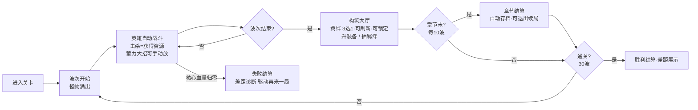

# 《Project Roguelike-TD》游戏设计文档（GDD v0.1）

> 状态：草案，待 review。所有数值为**起始平衡点**，用于跑通公式与曲线，正式数值以 playtest 为准。
> 定位：GDD 总纲。本文聚焦：核心循环 → 数值骨架（公式/曲线/表）→ 三大系统（技能/装备/羁绊）→ 联动引擎 → 经济与节奏。三体系完整设计见 [`systems/`](systems/) 目录。

---

## 0. 一句话定位

**横屏移动端、英雄为核心、带强 Rogue 构筑的波次防守游戏**。参考 KK 平台英雄防守图 + 金铲铲（羁绊/池子）+ 小丑牌（高风险高回报的词条赌博 + 商店刷新）。玩家防守 30 波进攻，通过"选体系（**技能=体系入口**，选了体系自动获得起点技能，随境界突破自动升级，详见 §4）+ 羁绊 3 选 1 抽取（可刷新）+ 手动大招 / 装备养成 / 羁绊吞噬"几条互相联动的成长线滚雪球。**核心心流目标见 `ENGAGEMENT_DESIGN.md`——"上头"靠 build 因果透明 + near-miss，不靠难度。**

---

## 1. 设计支柱（Pillars）

| 支柱 | 含义 | 对设计的约束 |
|---|---|---|
| **构筑爽感 Build Fantasy** | 每局拼出"离谱的数值组合" | 倍率必须能指数级叠加；多系统联动 |
| **每局不同 Replayability** | 局局体验不同 | Rogue 抽取池 + 词条随机 + 羁绊组合 |
| **风险换收益 Risk/Reward** | 像小丑牌，敢赌才变强 | 诅咒=代价换收益；羁绊池要取舍 |
| **秒懂、深度可挖** | 上手 1 分钟，构筑空间巨大 | 机制标签化；伤害乘区逐段可见 |
| **移动端友好** | 横屏、可碎片化、自动战斗 | 单章 8–10min / run ≤25min；可续局 |
| **Combo 可见** | 玩家能"看见" build 在咬合 | 命中伤害逐段弹出；结算诊断"差在哪" |

---

## 2. 核心循环



- **波次结构**：30 波 = 主线，分 3 章节（每 10 波一章），每 5 波小精英，第 10/20/30 波 Boss。
- **章节分段**：每章 8–10min，章末**自动存档**可续局（适配碎片时间）。完整 run ≤ 25min。
- **构筑大厅**：波次结束后进入，羁绊抽取可刷新/可锁定（§4.4），技能由选体系自动获得。
- **战斗微操**：英雄自动战斗 + **手动大招**（蓄力型，见 §11）。**结算**显示差距诊断（差多少伤害、建议补什么乘区）驱动"再来一局"。

---

## 3. 数值骨架（重点）

> 设计哲学：**敌人指数成长 → 玩家也必须指数成长 → 倍率要能"乘法叠加"**。
> 三层职责：
> - **羁绊 = 基础数值**（加法，撑起 ATK 等底子）
> - **技能/词条 = 伤害倍率**（混合加法/乘法，决定伤害表达）
> - **联动 = 最终乘区**（乘法、稀有、滚雪球的关键）

### 3.1 伤害主公式（Master Damage Pipeline）

每次命中：

```
hit_damage = ATK × atk_ratio × dmg_type_mult × skill_mult × final_mult × elemental_mult × crit_factor × defense_mult
DPS        = Σ(每次命中伤害) × attack_speed × projectile_count  （多段/多重射展开）
```

**英雄基础属性（SSOT，脚本据此锁定回归基线）**：
- 基础 ATK = 50
- 基础暴击率 = 5%
- **基础暴击伤害 = 150%**（即暴击造成 1.5 倍伤害；§8 走查的 210% = 150% + 60% 来自"聂家霸刀"羁绊）
- 基础攻速 = 1.0 次/秒

| 项 | 公式 | 说明 / 谁控制 |
|---|---|---|
| `ATK` | 基础 + Σ羁绊加成 | **羁绊层**控制；英雄基础 ATK = 50 |
| `atk_ratio` | 技能/武器系数（如 1.0、0.6×3 连击） | 技能定义 |
| `dmg_type_mult` | `1 + 物伤%` 或 `1 + 法伤%`（看技能标签） | 技能词条（**加法**叠加） |
| `skill_mult` | `1 + Σ技能内倍率词条`（+30% 物伤等） | 技能词条（**加法**叠加） |
| `final_mult` | `Π(1 + 最终伤害%)`（每条**乘法**） | **联动/吞噬**奖励，稀有且强 |
| `elemental_mult` | `1 + Σ属性伤害%`（火/冰/雷，独立乘区，**加法**叠加） | 技能词条（独立于物伤/法伤） |
| `crit_factor` | 暴击 ? 暴伤 : 1；期望 = `1 + 暴击率×(暴伤−1)`，基础暴伤=150% | 词条 |
| `defense_mult` | `1 − mitigation×(1−穿甲)`；**真伤**直接取 1 | 敌人护甲/抗性 |

**护甲减伤**：`mitigation = armor / (armor + K)`，K = 100（线性软上限，避免堆甲无敌）。
**真伤**：跳过 defense_mult，直接结算（用于"打不动的高甲怪"设计）。
**属性伤害**（火/冰/雷）：走 `elemental_mult` 独立乘区 + 附带状态（燃烧 DOT / 冰冻减速 / 雷链弹射）。

### 3.2 叠加规则（防止数值爆炸的关键）

| 类型 | 规则 | 例子 |
|---|---|---|
| 同源加法（同标签 %） | 加法叠加，收益递减感弱 | 物伤 30% + 30% = 60% |
| 跨源乘法（最终伤害） | 乘法叠加，每条都很强 | 最终 15% × 最终 20% = 1.15×1.20 |
| 暴击 | 率/伤分开，率封顶 100% | — |
| 多重射 | 每多 1 根弹 = 整段伤害再复制 | x2 弹 ≈ DPS×2（吃减益递减：散射） |

> **设计意图**：把"超强组合"的成本压在 **final_mult（联动）** 上，使其稀有、需要凑齐羁绊+技能才能触发 → 这就是"1+2+3 联动"的数值落点。

### 3.3 敌人曲线（30 波）

`enemy_hp = 100 × 1.18^(wave−1)`，敌人数量 `= round(8 + 1.5×wave)`。

| 波次 | 平均血量 | 怪物数 | 总血量 | 时长(s) | 所需 DPS |
|---:|---:|---:|---:|---:|---:|
| 1  | 100   | 10 | 1,000   | 26 | 38 |
| 5  | 194   | 16 | 3,102   | 30 | 103 |
| 10 | 444   | 23 | 10,212  | 35 | 292 |
| 15 | 1,015 | 30 | 30,442  | 40 | 761 |
| 20 | 2,321 | 38 | 88,198  | 45 | 1,960 |
| 25 | 5,311 | 46 | 244,306 | 50 | 4,886 |
| 30 | 12,150| 53 | 643,953 | 55 | 11,708 |

> **Boss 波血量定义**：Boss 波的"总血量"**已包含 Boss 本体**——总血量 = Σ小怪血量 + Boss 血量，Boss 占其中的 `boss_total_hp_share`（40%）。"单独结算"仅指 Boss 有独立血条 UI 显示，并非额外再算一份 DPS 需求。曲线是**指数**，意味着玩家 DPS 也必须指数增长 → 这就是为什么 final_mult 必须能乘法叠加。
>
> ✅ **B-3 校准完成（曲线 1.18→1.05，1000 局 18% 通关，near-miss 100%，全达标）**：
> - **原问题**：1.18 曲线下 0% 通关——玩家加法叠加的 DPS 跟不上指数曲线。
> - **校准**：曲线 1.18→**1.05** + 收入 ×3 + 羁绊 effect ×3.5。
> - **near-miss 模型**：清完波英雄持续受压（6-12%/波，但不致死，最低 25%）；清不完波强制打到残血（5-15%，主要死因）。波间回血 5%/波制造"贴线"节奏。
> - **结果**：通关率 18%（目标 10-40% ✅）、中位死波 15、死时血量 100% 落在 5-20% 惜败区。第 15 波所需 DPS 从 761（1.18）→ **148**（1.05）。详见站点 /run.html。

### 3.4 资源经济（由"装备层"驱动）

局内货币 = **金币**（仅当局有效；局外 meta 货币可后续设计）。

**收入（基础值，装备词条会放大）**：基础被动 1 金/秒、击杀 0.5 金/只、波次清场 15 金/波、Boss/精英 40 金。

**支出**：抽羁绊（3 选 1）30 金 + 10×已抽次数封顶 60、装备升级 15 + 4×当前等级、吞噬羁绊组合 80 金（金币 sink，每套仅一次）、羁绊重投 15 金起每次 +5（每波上限 3 次，见 §4.4）。

> ✅ **B-2 校准完成（境界树 + 收入二次减半）**：终局囤积 9634→255（<500 ✅）；后期操作数 1→4（3-5 ✅）；重投率 77%。三步修复：羁绊境界树（§6.1）、抽羁绊成本封顶 60、收入二次减半。详见站点 /economy.html。

---

## 4. 系统 1：技能（= 体系入口）

### 4.1 新机制：技能 = 体系入口

**技能不是抽取消费，而是"选体系的钥匙"**：

- **每体系 1 个起点技能**（遮天=天帝拳、星辰变=星辰变功法、宠魅=召唤·莫邪）。
- **选了体系 = 自动获得起点技能**，并解锁对应体系的羁绊池（没选的体系羁绊永不出现）。
- **技能随境界突破自动升级**——每次境界突破，起点技能自动获得强化（不需要手动升级、不需要抽取）。升级效果写在境界 reward 的 `skill_upgrade` 字段里。

```
遮天·天帝拳 升级路线（随境界自动，无需操作）：
  选了遮天（开局）  → 基础：物理倍率 2.0
  修到化龙          → +穿甲（龙骨之力）
  修到大帝          → +最终伤害（万道相合）
  修到天帝          → +肉度100%（天帝之躯）+ final_dmg 翻倍
```

> 数据文件：`balance/data/skills.yaml` 现在每体系只有 1 个起点技能。强化由境界 reward 的 `skill_upgrade` 提供。

### 4.2 三体系定位概览

首版 3 个体系，差异化定位（物理/法术/召唤）。细节见各体系文档：

| 体系 | 主打 | 起点技能 | 境界 | 完整设计 |
|------|------|----------|------|----------|
| **遮天** | 物理伤害 + 肉盾 + 后期真伤 | 天帝拳（随境界升级） | 轮海→天帝（9 境） | [`systems/zhutian.md`](systems/zhutian.md) |
| **星辰变** | 法术伤害 + 星辰属性 AOE | 星辰变·功法（随境界升级） | 星云→宇宙（9 境） | [`systems/xingchenbian.md`](systems/xingchenbian.md) |
| **宠魅** | 召唤多单位 + 魂宠进化 + 半魔化 | 召唤·莫邪（随境界升级） | 魂徒→万年强者（9 境） | [`systems/chongmei.md`](systems/chongmei.md) |

> 体系数量不设上限，玩家自己决定选几个（建议 3-4 个互补：物理+法术+召唤+生存）。单修必败于试炼——多修互补才能覆盖所有短板。详见 [`archive/skill_refactor_design.md`](archive/skill_refactor_design.md)。

### 4.3 词条池（机制标签，用于装备/境界 reward）

> 词条是技能和装备之间的"公共货币"——修改 `CombatStats` 的最小颗粒。技能强化改由境界 reward 提供；装备词条走赌博轨（§5）。叠加规则见 §3.2。

- **加法叠加**（N/SR）：暴击率 +15%（封顶 100%）、暴击伤害 +50%、物伤/法伤 +30%、攻速 +20%、穿甲/抗性穿透 +30%、眩晕 20% 概率、减伤 -15%（封顶 75%）
- **加法（弹数）**（SR）：多重射 +1（散射 -15% 伤害）
- **乘法（独立乘区）**（UR）：最终伤害 +15%；**属性伤害**（SR，火/冰/雷 +20% 并附带状态，独立于物伤/法伤）
- **特殊**：反伤 25%（SR）、真伤 10% 伤害转为真伤（SSR，加法）

### 4.4 刷新与锁定（羁绊商店机制）

在**构筑大厅**里，羁绊的 3 选 1 可花金币刷新（技能由选体系自动获得，无技能刷新）：**羁绊重投** 8 金起，每次 +3 金，每波软上限 5 次，可花少量金币**锁定** 1 张不随刷新消失。

- **递增成本**防止无限刷新破坏随机性；**软上限**强制玩家在"刷更好的"和"留着钱做别的"间取舍（小丑牌利息系统的等价物）。装备**保底轨不刷新**（确定性是它的价值）。

---

## 5. 系统 2：装备（控制"怎么变富/经济"）

> **实现状态（M3 ✅）**：保底轨 + 赌博轨 + 经济循环已全部实现。27 词条（19 正面 + 8 诅咒）。

### 5.1 双轨 Rogue 方案

**保底轨**（资源升级）：花金币升级，每级固定加一条经济属性（确定性）。**赌博轨**（里程碑抽词条）：+3/+6/+9 时抽 1 条词条，好坏都有（小丑牌式风险）。**掉落轨**（纯运气，可选）：精英/Boss 有概率掉"成品装备"，不作为主路径。

### 5.2 装备词条池（经济向 + 诅咒＝代价换收益）

> 诅咒**不是纯惩罚**，而是"代价换收益"——代价与收益势均力敌，让玩家**难以取舍**（详见 `ENGAGEMENT_DESIGN.md` §10）。

**经济词条（正）**：每秒金币 +3、杀敌金币 +1、一次性金币 +80、金币倍增（×1.15 乘区）、双倍金币概率（15%×2）、羁绊抽取折扣、羁绊吞噬增益（+1 级）。

**诅咒词条（代价 ↔ 收益，纠结型）**：血祭（受伤 +25% / 金币 +60%，滚雪球经济流）、焚天（每 5s 掉 1% 血 / 最终伤害 +20%，斩杀爆发流）、断舍离（羁绊池 -2 / 每羁绊 +30%，少而精构筑）、厄运契约（抽取成本 +20% / 传说概率 +50%，赌狗流）、时之刃（攻速 -15% / 命中伤害 +40%，慢速重击流）。

> 装备**不直接给常规战斗数值**，诅咒的代价/收益是这条规则的**例外**——正是这个例外制造了"要不要接这个 deal"的张力。

### 5.3 装备升级曲线

| 等级 | 成本 | 固定收益 |
|---:|---:|---|
| +1 | 15 | +1 金/秒 |
| +2 | 19 | +0.5 杀敌金 |
| +3 | 23 | +1 金/秒 + **抽词条** |
| +6 | 35 | 抽词条 |
| +9 | 47 | 抽词条（保底为正） |

> +9 的里程碑词条**保底为正面**（防脸黑劝退），是"长线投资"的回报。

---

## 6. 系统 3：羁绊（控制"基础数值/底子"）

### 6.1 机制

- 花 30 金**抽取**，3 选 1，放入**羁绊池**（上限 10）。**可刷新（8 金起递增）/可锁定**——见 §4.4。
- 每个羁绊给一条**基础数值**（ATK%、血量%、攻速%、暴击…）。
- 羁绊按**体系（path）**分组，每体系是一条境界修炼路径（如遮天：轮海→道宫→…→天帝，9 境界）。
- **集齐当前境界羁绊 → 可吞噬突破**：消耗对应羁绊 → 获得境界 reward（含起点技能升级），进入下一境界。**已吞噬境界**用于触发跨系统联动（见第 7 节）。境界树解决"后期有事做"。

### 6.2 池子取舍（Risk/Reward）

- 池子上限 10 → 玩家必须在"留着凑境界 / 吞噬腾位 / 换更强单卡"间取舍。
- **与诅咒的交互**：诅咒"断舍离"会把池子上限 -2（换"每个羁绊效果 +30%"）。若获取时池中羁绊数 > 新上限（8），**玩家手动选丢弃哪些**直到不超限。

### 6.3 三体系概览（细节见 systems/）

三体系各有 9 境界阶梯、~31-42 个境界羁绊、1 个起点技能、3 条联动。完整内容见：
- **遮天**（物理/肉盾/真伤）：[`systems/zhutian.md`](systems/zhutian.md) — 9 境界 + 九秘（境界子羁绊 `zt_jm_*`，修满触发九秘合一）+ 天帝拳联动。
- **星辰变**（法术 AOE）：[`systems/xingchenbian.md`](systems/xingchenbian.md) — 9 境界 + 流星泪成长线（奇遇，后面做）+ 星辰变功法联动。
- **宠魅**（召唤养成）：[`systems/chongmei.md`](systems/chongmei.md) — 9 境界 + 3 召唤单位 + 半魔化变身 + 莫邪进化联动。

> **九秘**：遮天境界子羁绊（`zt_jm_*`），分散到遮天 9 个境界，修满遮天即集齐触发"九秘合一·神禁"联动。详见 [`systems/zhutian.md`](systems/zhutian.md)。
>
> ⚠️ IP 提醒：遮天/宠魅/星辰变 仅为主题参照，商业上线须授权或换皮。数据层用**中性 id**，展示名集中到 i18n 文案层，换皮时只改文案。

---

## 7. 联动引擎（1+2+3 的核心）

> 这是把三大系统缝合成"构筑爽感"的关键。用**数据驱动的规则引擎**实现（详见 [`TECHNICAL_ARCHITECTURE.md`](TECHNICAL_ARCHITECTURE.md) §8.3）。

**触发条件语义**（统一用以下三种）：

| 条件 key | 语义 |
|----------|------|
| `bond_devoured_set` | 该体系**已修满顶级境界**（吞噬完成）。所有联动统一走此条件——联动是修炼到顶的终极奖励 |
| `path_realm` | `{path_id: ">=N"}` 某体系修到第 N 境（0-indexed） |
| `equipment_affix` | 装备了该词条（M3 装备系统后） |

> 设计理由：联动是修炼到顶的终极 combo，门槛高、回报大。修炼路径 = 纯正反馈，修满才有联动奖励。规则结构（伪数据）：`trigger: { all: [ { bond_devoured_set: zhutian } ] }` + `effect: { final_dmg_mult: 1.0 }`（全部满足才触发，效果走 final_mult 乘区）。

**联动清单（首版 8 条；其中 3 个为 SSR 终极 combo ★）**

| 联动 | Rarity | 触发 | 效果 |
|---|---|---|---|
| **天帝之拳** ★ | SSR | 修满遮天 | 最终伤害 +100% |
| **大圣闹天** ★ | SSR | 吞噬黑神话 + 装备"金币倍增" | 变身期间金币 ×3 + AOE |
| **风雷合击** ★ | SSR | 吞噬风云 + path_realm | 雷属性额外弹射 3 次 + 追击 |
| 圣体真伤 | SSR | 吞噬遮天 + 真伤词条 | 真伤比例 +15% |
| 风云追击 | SSR | 吞噬风云 + 任意 | 每 3 次攻击追击 100% 伤害 |
| 鼎立圣威 | SSR | 天帝鼎 + 圣人果位 | 最终伤害 +15%（乘区） |
| 厄运契约 | SR | 诅咒"厄运契约" + 抽到 UR | 该 UR 效果额外 +50% |

> 各体系专属联动（遮天九秘合一、星辰变黑洞吞噬、宠魅半魔化）见对应 [`systems/`](systems/) 文档。
>
> ✅ **B-3 联动引擎已实装并验证**：触发联动局通关率 **90%** vs 未触发 **14%**——**联动是通关关键**。transform / chain / followup 三类效果均建模完成，所有联动统一走 final_mult 乘区。

---

## 8. 一个构筑走查（验证数值自洽）

目标：第 15 波（所需 DPS ≈ 761）。

玩家构筑（示例，**每个数字都可追溯**）：
- **羁绊**（5 个，未超池上限 10）：荒古圣体 +15% ATK、圣人果位 +10% 暴击率、风神腿 +20% 攻速、排云掌 +25% 技能倍率、聂家霸刀 +60% 暴伤。
- **遮天 2 件套**（荒古圣体 + 圣人果位）→ +20% ATK
- **ATK 推导**：基础 50 × (1 + 0.15 + 0.20) = 50 × 1.35 = **67.5**
- **技能"天帝拳"**词条：物伤 +60%、最终伤害 +15%（传说）、多重射 +1、暴击率 +15%。
- **属性推导**：
  - 暴击率 = 5%（基础）+ 10%（圣人果位）+ 15%（词条）= **30%**
  - 暴伤 = 150%（基础）+ 60%（聂家霸刀）= **210%**
  - 攻速 = 1.0（基础）× (1 + 0.20) = **1.2/s**

走公式：
```
单发 = ATK × atk_ratio × dmg_type × skill_mult × final_mult
     = 67.5 × 1.0 × (1+0.60) × (1+0.25) × (1+0.15) = 155.7
暴击期望因子 = 1 + 0.30×(2.10−1) = 1.33
单发期望 = 155.7 × 1.33 = 207
多重射×2（散射递减×1.85） → 207 × 1.85 = 383 / 攻击周期
攻速 1.2/s → DPS ≈ 383 × 1.2 = 460（护甲前）
敌人护甲减伤 ~25% → 实际 DPS ≈ 345
```
345 vs 所需 761 → **约 0.45×，明显不够**。❌ 揭示一个真问题：**纯羁绊+单技能词条的中期 build 打不过第 15 波**。

> **这个"不够"是设计意图的暴露点**：① 基础数值（羁绊层）撑不起 DPS，必须靠 final_mult 联动——印证"联动=滚雪球关键"；② 凑齐"天帝之拳"联动（final +100%）：DPS ×2 ≈ 689，再叠加元素/更多词条才稳过；③ **这正是 near-miss 设计的数值基础**——玩家会"差一点"打过，驱动刷新/凑联动。注：B-3 校准后曲线降为 1.05，第 15 波所需 DPS 从 761 降至 148，中期 build(345) 现在能稳过。

---

## 9. 节奏与心流目标

> 完整心流机制见 `ENGAGEMENT_DESIGN.md`。本表是节奏约束的速查。

| 阶段 | 波次 | 玩家体验目标 | 对应心流齿轮 |
|---|---|---|---|
| 入门 | 1–5 | 学会抽羁绊 3 选 1、第一次"爽"到清屏 | 短期目标 |
| 起势 | 6–12 | 攒出第一套像样的 build，金铲铲式经营池子 | 商店刷新 |
| 拐点 | 13–20 | 开始追求联动，赌装备里程碑词条 + 诅咒取舍 | 赌徒代价 |
| 决胜 | 21–30 | 验证 build 上限，Boss 战高潮，濒死体验 | near-miss |
| 失败 | 任意 | 差距诊断（差多少伤害/缺什么乘区）→ 驱动"再来一局" | near-miss |

**血量曲线设计约束**（M5a）：所需 DPS 与玩家 DPS **长期接近但不交叉**，只在 build 成型后拉开——让玩家全程贴着死亡线，又一波波惊险过关。

---

## 10. 决策记录与剩余开放问题

### 已确认决策
1. **引擎**：✅ Godot 4。2. **朝向**：✅ 横屏，基准 1920×1080。3. **服务端**：✅ 需要（客户端跑战斗、服务端管 meta/经济/排行/校验）。
4. **商店刷新**：✅ 重投递增 + 软上限 + 锁定（§4.4）。5. **诅咒**：✅ 代价换收益，平衡到"难取舍"（§5.2）。6. **微操**：✅ 手动大招（§11）。
7. **分章节**：✅ 10 波一章节，可中断保留续局（§2）。8. **终极 combo**：✅ 首版 3 个 SSR（§7）；三重联动抬 EX 档。9. **碎片化**：✅ 支持续局。
10. **Boss debuff**：✅ 固定 debuff + 出场顺序随机，统一强度不分级，物理/法术改减免 50%（§12）。11. **回血**：✅ 玩家回血 + Boss 回血都做（§12.4）。12. **应对道具**：✅ 简化为两档（换/删，§13）。
13. **Boss 预告**：✅ 打完 Boss 1 即预告 Boss 2 的 debuff（§12.3）。14. **禁疗之印**：✅ 改"回血 −70%"（保留余地，不致命）。15. **局外 meta**：✅ 要做、首版不做；架构预留 `MetaState` 口子。
16. **英雄 = 核心**：✅ 英雄既是防守目标又是唯一输出，取消独立 Core 节点。17. **弹道锁定**：✅ 弹道持有目标引用、追踪飞行、到达才结算伤害。18. **羁绊成本递增**：✅ 30 + 10×已抽次数，封顶 60。
19. **羁绊池多样性**：✅ 排除已拥有；50% 抽当前境界、50% 抽全池。20. **技能 = 体系入口**：✅ 技能从抽取消费改造为体系入口（§4），每体系 1 起点技能随境界升级。

### 剩余开放问题
- **Q1 后端语言**：Go 还是 Node？（建议 Go）
- **Q2 局外 meta 成长**：✅ 要做，首版不做，架构预留。
- **Q3 羁绊 IP**：数据层已用中性 id，展示名建议集中到 i18n 层。
- **Q4 数值难度曲线**：✅ 已定 1.05（B-3 校准）。
- **Q5 变现模式**：买断 / 内购+广告 / 免费+激励广告？

---

## 11. 战斗操作：手动大招（决策 6）

> 加一个**手动大招**给关键时刻掌控感——心流"战斗参与感"齿轮的落地（`ENGAGEMENT_DESIGN.md` §5）。

**机制**：
- 英雄有**大招能量槽**，自动战斗/击杀/受击时蓄力（满槽时间随波次动态：前 5 波约 20s，后期约 30–45s，可被词条加速）。**设计约束**：保证每波至少能蓄满并释放 1 次。
- 玩家点击大招按钮主动释放 → **爆发效果**（清屏 AOE / 巨额单体 / 短时增益）。大招**继承当前 build 的乘区**，走 final_mult 乘区纳入统一公式。

**验收（B-3）**：大招对清波效率的贡献占比目标 15%–25%（过低=存在感弱，过高=变成必放自动）。

---

## 12. Boss Debuff 系统（决策 10）

> 参考 Balatro 的 Boss Blind：Boss 带一个**破坏规则的 debuff**，增加随机性与应变性，逼玩家多元化构筑。

**三原则**：① **可见性**——Boss 波开始前展示 debuff，是策略不是被阴；② **应变性**——debuff 削弱 build 某一方面，逼多元构筑；③ **痛但不致命**——所有 debuff 是减免/削弱而非完全失效。

### 12.2 Debuff 池（统一强度，不分级）

按克制 build 分组（每条 Boss 绑定一个）：

- **暴击流**：致盲之眼（暴伤 −50%）、暴击瓦解（暴击率 −30%）
- **穿甲/多重射流**：破甲之兆（护甲穿透 −100%）、单发之咒（多重射 −2 弹，不低于 1）
- **控制流**：不动如山（怪免疫眩晕/定身）
- **经济流**：贪婪之噬（本波金币 −50%）
- **数值堆叠流**：羁绊压制（本波羁绊效果 −30%）
- **抽取流**：封印之手（下波大厅抽取/刷新次数 −1）
- **法术/物理流**：**法术抗性**（怪受法术伤害减免 50%）、**物理抗性**（物理减免 50%）
- **慢速/高频流**：急行之令（怪移速 +50%，DPS 窗口缩短）、镜面之甲（怪反弹 20% 受击伤害）
- **大招/挂机流**：大招禁制（大招能量 −80%）、反噬之力（每次受击额外掉核心血）
- **DPS 不足/回血流**：不灭之躯（Boss 血量 +50%）、**回春之核**（Boss 每 5s 回 5%）、**禁疗之印**（本波回血 −70%）

### 12.3 规则

- **固定 debuff + 顺序随机**：每个 Boss 绑定**一个固定** debuff（有记忆点），但 3 个 Boss 出场顺序随机 → 每局体验不同。不叠加，避免组合不可解。
- **提前预告**：打完 Boss 1 结算时，**立刻展示 Boss 2 的 debuff**，玩家有一整章时间针对性构筑。应对道具见 §13。

### 12.4 回血机制（决策 11）

为支撑"禁疗之印"/"回春之核"这对张力，补齐**玩家回血**来源：黑神话·法天象地（羁绊吞噬，+30% 血量上限）、吸血词条（造成伤害 3% 转血）、复苏羁绊（每 5s 回 2% 最大血量）、圣泉装备词条（击杀回 1% 血）。**回血流**成为合法 build，但会被"禁疗之印"大幅削弱（−70%），需多元备份。

---

## 13. 应对道具（决策 12：简化为两档）

> 决策：**不单独开系统，融入经济/商店**。道具极简化为两个档位。Boss 波前的构筑大厅，Boss 信息面板上有"换 / 删"两个按钮。

| 档位 | 动作 | 成本 | 效果 | 心理定位 |
|---|---|---|---|---|
| **换 (Reroll)** | 重新抽一个 debuff | **40 金**（约 1.3 次抽羁绊） | 随机抽一个**新** debuff 替换当前（可多次换，不排除换回更糟的） | 赌博：可能更好或更糟 |
| **删 (Remove)** | 直接移除 debuff | **120 金**（约 4 次抽羁绊，一次性） | 该 Boss 波 debuff **完全失效** | 破财消灾：保底，但贵 |

> 金币与抽羁绊/升装备**同一池**。"删 debuff 要 120 金" = 放弃 ~4 次抽羁绊，是真实取舍。**验收**：换使用率 30%–50%、删使用率 15%–30%、带 debuff vs 不带通关率差距 <15%。**换是"穷人选项"（赌一把），删是"富人选项"（稳过）**——两者让不同经济状态的玩家都有出路，build 够强可以不花钱硬刚。
