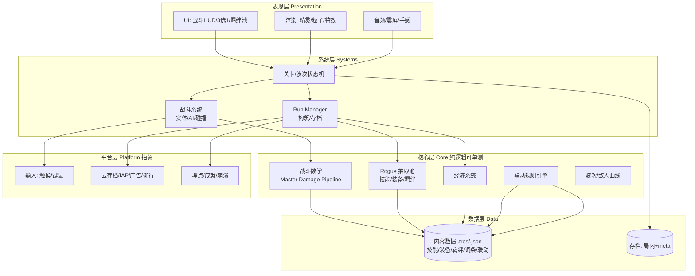

# 《Project Roguelike-TD》技术架构设计（v0.1）

> 目标平台优先级：**iOS / Android（P0）** ＞ Web（P1）＞ Linux/桌面（P2）。
> 设计目标：**一份代码、多端导出**；**数据驱动内容**（策划可改数值不动代码）；**核心逻辑与表现分离**（可单测、可复现、未来可做异步对战）。

---

## 1. 引擎选型

### 1.1 结论：**Godot 4.x（推荐）**，备选 Cocos Creator 3.x。

理由：本作是 **2D、移动端优先、需 Web + 桌面** 的轻量 Rogue 游戏。Godot 4 在这个画像下综合最优。

### 1.2 对比

| 维度 | **Godot 4**（推荐） | Cocos Creator 3 | Unity |
|---|---|---|---|
| 授权/费用 | MIT，**免费无分成** | 免费（企业版收费） | 有分成门槛，条款常变 |
| 2D 能力 | ★★★★★ 原生 2D | ★★★★★（TS/JS，Web 强） | ★★★（2D 非原生） |
| 多端导出 | iOS/Android/Web/Linux/Win/macOS | 同上（Web 尤其强） | 同上 |
| 包体/启动速度 | 小、快（移动端友好） | 小、快 | 较大 |
| 语言 | GDScript（易上手）/ C# / C++ | TypeScript / JavaScript | C# |
| 数据驱动 | Resource 系统天然支持 | JSON/Prefab | ScriptableObject |
| 学习曲线 | 低 | 中 | 中高 |
| 生态/招聘 | 增长快，偏独立向 | 国内 2D 手游多 | 最大 |

> 若团队**重度 Web 经验 / TS 背景**，Cocos Creator 是同等优秀的选项。Unity 在本场景"杀鸡用牛刀"，且授权成本对独立项目不友好。

### 1.3 语言策略

- **业务/玩法**：GDScript（迭代快、生态好）。
- **性能热点**（如大量弹幕/碰撞）：GDScript 足矣，必要时用 C# 或 GDExtension(C++) 重写。
- **核心数值/经济/抽取逻辑**：写成**纯逻辑类**（不依赖节点/渲染），便于单测与跨端复用。

---

## 2. 总体架构（分层 + 数据驱动）



### 2.1 分层职责

| 层 | 职责 | 关键约束 |
|---|---|---|
| **Core 核心层** | 战斗数学、经济、抽取池、联动引擎、曲线 | **纯逻辑、不依赖引擎节点**、可单测、可 seed 复现 |
| **Systems 系统层** | 关卡状态机、战斗实体（英雄/怪/弹）、Run 管理、存档 | 桥接 Core 与表现，事件驱动 |
| **Presentation 表现层** | 渲染、UI、特效、音效 | 只读 Core 事件，不写玩法逻辑 |
| **Data 数据层** | 所有内容 = 数据；存档 | 策划可编辑，热重载 |
| **Platform 平台层** | 输入、IAP、广告、云存档、埋点 | **接口抽象**，各端实现不同 |

### 2.2 关键解耦手段

- **事件总线（EventBus / Godot Signals）**：`enemy_killed`、`resource_changed`、`choice_presented`、`bond_devoured` … 表现层订阅，玩法层发布。
- **状态机**驱动游戏流：`Menu → Run → Wave → Choice → Boss → RunEnd`。
- **组件组合**做实体（英雄 = [Mover][Attacker][Health][SkillSet]…）。
- **种子化 RNG**：所有随机（抽取、掉落、暴击）走同一个可种子化的随机源 → 可复现 bug、可做回放/异步排行。

---

## 3. 数据驱动内容（核心设计）

> 原则：**技能/装备/羁绊/词条/联动 = 数据，不是代码**。策划在 Godot Inspector 或表格里改数值，无需改代码、无需重新编译。

### 3.1 用 Godot `Resource`（.tres）定义内容

```
# res://data/skills/emperor_fist.tres  (SkillDefinition)
name = "天帝拳"
rarity = Legendary
tags = ["physical", "single_target"]
atk_ratio = 2.0
base_affixes = ["物理伤害+30%"]
affix_pool = ["res://data/affixes/最终伤害.tres", ...]
```

```
# res://data/synergies/zhutian_emperor_fist.tres  (SynergyRule)
id = "zhutian_emperor_fist"
trigger = { all = [ BondDevouredSet("zhutian"), SkillOwned("emperor_fist") ] }
effect = { final_damage_mult = 1.0 }
```

### 3.2 联动规则引擎（实现"1+2+3 联动"）

- `SynergyEngine` 在关键事件（羁绊吞噬、技能获取、词条变化）时**重算 active 规则**。
- 战斗结算时，`DamagePipeline` 向 `SynergyEngine` 查询当前生效的 `final_mult` 等修饰。
- 新增联动 = 加一个 `.tres` 文件，**零代码**。这是本作可扩展性的基石。

### 3.3 内容管线（可选，量大了再做）

- 小团队：直接在 Godot 里编辑 `.tres`。
- 量大后：Google Sheet → 导出 JSON → 导入为 `.tres`，让非技术策划批量调数值。

---

## 4. 目录结构（Godot）

```
res://
  data/                 # 内容数据（.tres/.json）
    skills/ equipment/ bonds/ affixes/ synergies/ waves/ enemies/
  core/                 # 纯逻辑（可单测）
    combat/ economy/ rogue_pools/ synergy_engine/ curves/
  systems/              # 系统层
    run_manager/ wave_spawner/ combat_system/ inventory/
  scenes/               # 场景：battle/menu/choice_ui/run_end
  ui/                   # UI 组件（HUD、3选1卡牌、羁绊池面板）
  entities/             # hero/enemy/projectile 场景+组件
  art/ audio/ fonts/ shaders/
  platform/             # 平台服务实现（ios/android/web/linux）
  save/                 # 存档读写
  tests/                # 单元测试（GUT 框架）
```

---

## 5. 跨平台策略（一份代码多端导出）

### 5.1 平台矩阵

| 平台 | 优先级 | 输入 | 注意点 |
|---|---|---|---|
| Android | P0 | 触摸 | 包体优化、ARM64；适配全面屏/刘海 |
| iOS | P0 | 触摸 | 签名/TestFlight；内存与发热控制；App Store 审核（IAP 强制走原生） |
| Web | P1 | 触摸+键鼠 | Godot Web 导出（WASM）；首包要小、流式加载；移动浏览器性能边界 |
| Linux/桌面 | P2 | 键鼠为主 | 导出模板即可；可作为开发/调试主平台 |

### 5.2 关键工程要点

- **输入抽象**：定义 `InputProvider` 接口（tap/drag），触摸与键鼠各自实现，玩法层不感知。
- **响应式 UI（横屏优先）**：基准分辨率 1920×1080（横屏），用 Godot 锚点/容器在手机/平板/浏览器自适应；窄屏设备（手机横屏）按高度缩放，保证战场与构筑 UI 同屏可见。
- **性能预算（移动端）**：
  - 弹幕/敌人**对象池**（关键！多重射 + 大量怪 = 海量节点，必须池化复用）。
  - 控制 draw call：图集（TextureAtlas）、合并粒子。
  - 物理：大量弹用简化的碰撞（距离判定/Area2D），避免 RigidBody 满天飞。
  - 目标：60 FPS，发热可控。
- **资源策略**：纹理按平台压缩（ETC2/ASTC for mobile）；音乐 OGG、音效 WAV/MP3。
- **Web 特别注意**：Godot Web 导出对大包不友好，首屏资源 < 20MB，其余流式/按关卡加载。

---

## 6. 存档与后端（含服务端）

> 决策：**需要服务端**。单局战斗仍**客户端本地计算**（不卡实时、省服务器），但**所有跨局、跨设备的持久状态与经济流都经服务端**，做权威校验、防作弊与社交功能。

### 6.1 客户端 / 服务端职责切分

| 职责 | 归属 | 说明 |
|---|---|---|
| 单局战斗模拟 | **客户端** | 实时性要求高，不上云；用种子化 RNG 保证可复现 |
| 局内 RunState | 客户端 + 云备份 | 断线可续；服务端只存检查点，不参与逐帧 |
| Meta 进度（局外成长、货币） | **服务端权威** | 客户端只读展示，所有增减由服务端结算 |
| 通关结算 / 奖励发放 | **服务端** | 客户端上报"通关凭证(种子+build+结果)"，服务端校验后发奖 |
| IAP / 激励广告奖励 | **服务端校验** | 凭平台回执到服务端入账，防伪造 |
| 云存档 | 服务端 | 跨设备同步 MetaState |
| 排行榜 / 每日种子 / 异步挑战 | 服务端 | 因 RNG 可种子化，天然支持"每日同一种子全网比拼" |
| 账号 / 鉴权 | 服务端 | 游客账号 + 平台账号（Apple/Google）登录 |

> **局外 Meta 进度的预留口子（GDD Q2 决策：要做，首版不做）**：
> 上表中"Meta 进度"虽为首版**不实现**功能，但架构**现在就预留**，避免后期改不动：
> - `RunState` / `MetaState` schema 分离：`RunState`（局内）首版实现，`MetaState`（局外：货币、解锁项、成就）首版为空壳但字段位占好。
> - 通关结算接口首版只回 `RunState` 结算，但签名预留 `meta_rewards` 返回值（首版返回空数组）。
> - 失败结算首版**清零 RunState**（无 meta 保留），但结算页 UI 预留"meta 奖励"区域（首版隐藏）。
> 这样后续开启局外成长时，只填 `MetaState` + 打开 UI，无需改协议/服务端主流程。

### 6.2 技术选型（建议，待确认）

- **后端语言/框架**：Go（gin）或 Node（Nest）——轻量、并发好、招人容易；玩法校验逻辑可与 Python 数值验证脚本共享同一套**纯数据/公式定义**（见 B 路线产出）。
- **存储**：PostgreSQL（玩家/meta/排行）+ Redis（排行榜 ZSET / 限流 / 会话）+ 对象存储（存档快照）。
- **通信**：REST（结算、商店、排行）即可；无需 WebSocket（无实时对战）。
- **防作弊**：通关凭证 = `种子 + 关键随机序列哈希 + build 快照`，服务端可用同一种子**重放校验**结果是否合理（这是种子化 RNG 的额外红利）。

> 详细服务端架构（表结构、API、部署、CI）在进入 M7 前另起一份文档；当前阶段先以 B 路线的**数值验证脚本**统一"权威公式与数值表"，作为客户端与服务端共享的 single source of truth。

---

## 7. 测试与平衡工具

- **单元测试**（GUT 框架）：覆盖 `DamagePipeline`、`Economy`、`RoguePools` 权重、`SynergyEngine` 触发。
- **平衡调试面板**（仅 debug build）：一键加资源、刷波、强制刷指定词条/羁绊、显示实时 DPS。
- **DPS/经济曲线工具**：从数据计算理论 DPS 与所需 DPS 曲线（可做成一个独立小脚本/表格），playtest 前先做静态校验。

---

## 8. 开发路线（建议分阶段，避免摊大饼）

| 阶段 | 范围 | 产出 |
|---|---|---|
| **M0 引擎与骨架** ✅ | Godot 项目、分层架构、EventBus autoload、数据 JSON 接入、debug 面板 | `client/` 能打开运行，显示数据加载校验（20技能/71羁绊/8路径/29词条/9联动） |
| **M1 核心战斗循环** ✅ | 英雄自动战斗 + 波次刷怪 + 基础敌人曲线 + Master Pipeline | 能"打怪、清波、看血条" |
| **M2 技能 3 选 1** ✅ | 抽取池、词条、3 选 1 UI、羁绊抽取、英雄=核心、弹道锁定、卡片加成显示 | **第一个可玩 vertical slice** |
| **M3 装备经济**（1–2 周） | 升级/里程碑词条/掉落 | 经济滚雪球 |
| **M4 联动引擎**（1–2 周） | SynergyEngine + 首批 5–8 条联动（客户端接入 transform/chain/followup） | 1+2+3 缝合完成 |
| **M5 内容与平衡**（持续） | 多套系、多技能、曲线调参 | 可玩性达标 |
| **M6 跨端与发布**（2–3 周） | iOS/Android/Web 导出、IAP/广告、云存档 | 上架/itch.io |

> 建议 **M2 结束就做第一次 playtest**，验证"3 选 1 + 自动战斗"是否好玩，再决定后续投入。

### 8.1 客户端实现现状（M0–M2，截至 2026-07-05）

> 本节记录 Godot 客户端**实际落地**的架构，与上方"建议路线"对照。

**核心设计决策：英雄 = 核心（hero-as-core）**

英雄既是防守目标（被怪走到 = 扣英雄血），又是唯一输出（全屏攻击范围自动开火）。**没有独立的 Core/基地节点**——简化了架构（少一个实体、少一套碰撞），也更适合"英雄就是主角"的沉浸感。怪沿 Path2D 走向英雄，走到 = 英雄掉血；英雄血归零 = 失败。

**分层落地（strict-typed GDScript，Godot 4.6）**：

| 层 | 文件 | 职责 |
|---|---|---|
| Core | `combat_stats.gd` | Master Damage Pipeline（移植自 Python，常量一致：ATK=50/暴击5%/暴伤1.5/攻速1.0/护甲K=100） |
| Core | `effect_resolver.gd` | ~25 个 effect key → CombatStats（atk_pct/crit/攻速/物法伤/元素/最终/真伤/穿甲/弹数 + atk_ratio_delta） |
| Core | `rogue_pools.gd` | 技能 3 选 1（50% 新技能/50% 词条，权重 60/30/8/2）+ 羁绊抽取（71 池，排除已拥有，50% prefer 境界/50% 全池）+ 境界吞噬；加载 skills/affixes/bonds JSON |
| Core | `wave_curves.gd` | 读 waves.json，算 hp/count/duration（曲线 1.05^wave） |
| Systems | `game_manager.gd` | 波次状态机（READY→WAVE_IN_PROGRESS→WAVE_CLEARED→WON/LOST），连接 spawner/hero/hud/lobby |
| Systems | `wave_spawner.gd` | Timer 节点驱动刷怪（参考 quiver-td 模式），信号 wave_finished |
| Systems | `build_state.gd` | 金币/技能/羁绊池/境界/累积 effect；bond_draw_cost()=min(60, 30+10n)；assemble_stats()→CombatStats |
| Systems | `event_bus.gd` | autoload 全局信号总线（enemy_killed/reached_core/gold_changed/...） |
| Systems | `target_priority.gd` | 目标选择（最近/最远/最高血/最低血） |
| Scenes | `hero.gd` | 英雄=核心：max_hp/take_damage、全屏范围自动开火、HP 环显示、点击切换目标优先级 |
| Scenes | `enemy.gd` | Node2D 沿 Path2D 进度移动；set_current_hp setter（归零自动 died）；数据驱动 kill_reward/leak_damage |
| Scenes | `projectile.gd` | **追踪锁定**：持有 target 引用，飞到目标当前位置才结算伤害（不会误伤途中敌人） |
| Scenes | `hud.gd` | 波次/敌人数/金币/英雄血条 + 技能/羁绊触发按钮（按需打开 lobby） |
| Scenes | `lobby.gd` | 按需选择器：3 选 1 卡片显示加成数值（黄色 desc）、刷新/跳过/Tab 切换、z_index=100 不被怪遮挡 |

**数据管线**：`balance/data/*.yaml`（Python SSOT）→ `export_json.py` → `client/data/*.json`（Godot 原生读取，零依赖）。

**M2 已知缺口（后续里程碑补）**：
- 联动精确效果（transform/chain/followup）未接入客户端（Python 已建模，见 M4）
- 装备系统未做（M3）
- 服务端未做（M6+）
- 怪的移动仍是固定 Path2D（**下一步计划改为土豆兄弟式房间**——见 §8.2）

### 8.2 计划中的架构演进：固定路径 → 房间生存（土豆兄弟式）

> **状态：规划中，待 review 后实施。** 会动到核心系统（enemy 寻路、spawner、hero 定位），但 Core 层（数值/抽取/管线）基本不动。

当前：怪沿固定 Path2D 走向英雄（英雄固定在屏幕中央）。
目标：英雄可在**固定房间**内自由移动，怪**随机刷新**且会移动追击英雄，英雄自动释放技能——沉浸感更强，更接近土豆兄弟/吸血鬼幸存者的手感。

预计改动范围：
- `enemy.gd`：从 Path2D 进度移动 → 自主移动（朝英雄追击 / 房间内游荡）
- `wave_spawner.gd`：从 Path2D 出生 → 房间边缘随机位置出生
- `hero.gd`：新增玩家操控移动（摇杆/键盘）；攻击范围从全屏 → 局部圆形
- `main.tscn`：Path2D → 房间边界（CollisionShape2D / 矩形区域）；英雄出生点
- 新增：`enemy_ai.gd`（追击/分离/避障，简化版 steering）
- Core 层（CombatStats/RoguePools/WaveCurves/BuildState）**基本不动**——数值与构筑逻辑与移动方式解耦

---

## 9. CI / 构建建议

- GitHub Actions：每个平台一个导出 job（Godot CLI headless 导出）。
- 主分支自动构建 Web 版部署到 itch.io / GitHub Pages，便于随时试玩分享。
- iOS/Android 走 TestFlight / Play 内测轨道。

---

## 10. 决策记录与剩余开放问题

### 已确认决策（2026-07-03）
1. **引擎**：✅ Godot 4。
2. **朝向**：✅ 横屏（基准 1920×1080）。
3. **服务端**：✅ 需要。客户端跑战斗、服务端管 meta/经济/排行/校验（见第 6 节）。

### 剩余开放问题
4. **后端语言**：Go 还是 Node？（建议 Go，待定）
5. **多语言/本地化**：首发中文，是否预留 i18n？（建议预留，成本低）
6. **变现模式**：买断 / 内购 + 广告 / 免费+激励广告？（影响 IAP 接入时机与是否需要更重的服务端校验）
7. **服务端部署目标**：自建 / 云厂商 BaaS / Firebase？（影响运维成本）
